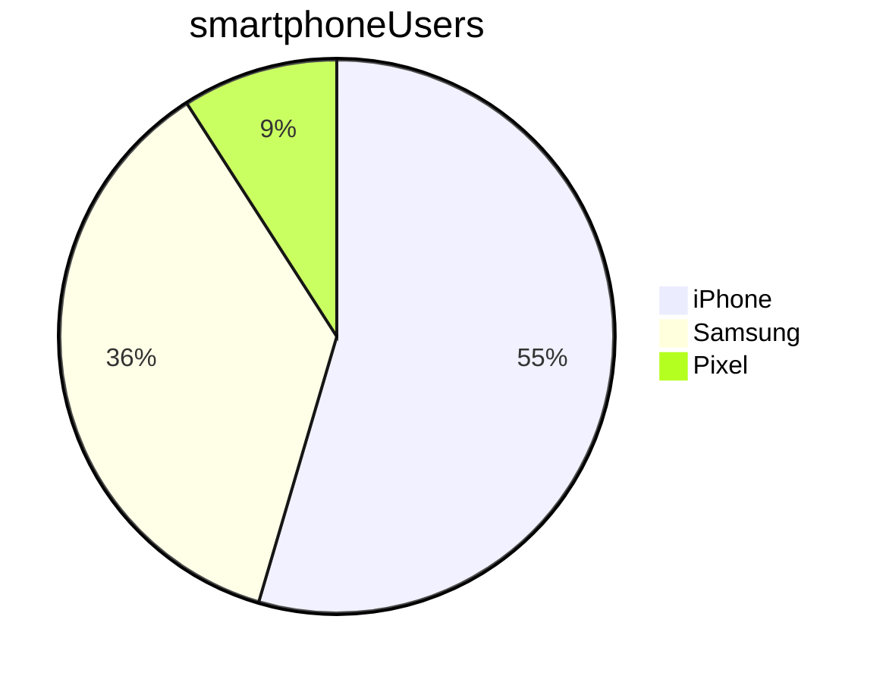

# Servicenow

# Table of contents

- [Servicenow](#servicenow)
- [Table of contents](#table-of-contents)
  - [Web Technologies](#web-technologies)
    - [HTML](#html)
    - [C# test](#c-test)
    - [JavaScript](#javascript)
      - [Objects](#objects)
        - [Classes](#classes)
          - [Methods](#methods)
  - [GitHub Flavoured Markdown](#github-flavoured-markdown)
  - [Tasks and tables](#tasks-and-tables)
  - [Mermaid](#mermaid)
  - [Links](#links)

## Web Technologies

### HTML

### C# test

### JavaScript

#### Objects

##### Classes

###### Methods

*This is italic text*

_also italics_

**This bold**

__this is bold also__

***Bold* but only partly italic**

> West Ham United Is the best team 
> > No it's not Arsenal united is
> > > I like by Aston city players


> #### TRAINER PROMPT
>
> Explain the HTTP pipleline within the the program.cs file

* Haaris
* Usun
* Kavan


- James
- Arthur
- Josh


1. Mat
2. Umar
3. Safee


<br>

1. Make a new application in ServiceNow
   - Start by clicking the application 
2. Do this


## GitHub Flavoured Markdown

This is `code`

```sql
SELCT * FROM Customers
```

```c#
// this code runs
public static void Main()
{
    Console.WriteLine("Hello, World!");
}
```

```javascript
funtion add(num1, num2){
    return num1 + num2;
}
```

## Tasks and tables


Name    |   Street   |  Town
--------|------------|----------
Cathy   | Main St    | Birmingham
John    | Maple Drive  | Stafford


- [ ] This is a list item
- [x] This is a finished item

## Mermaid




## Links

- [Contents](#servicenow)

- [Web Technolgoies](#web-technologies)

- [c# Test](#c--test)

- [json](./intro.json)


[Birmingham weather](https://www.bbc.co.uk/weather/2655603)

